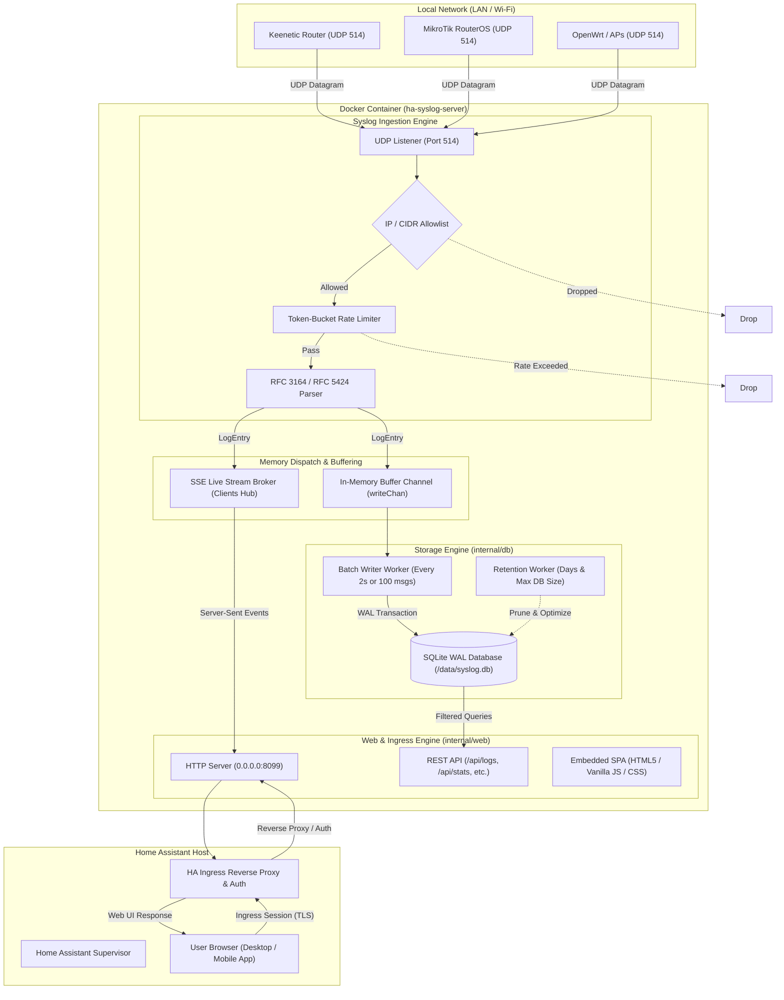
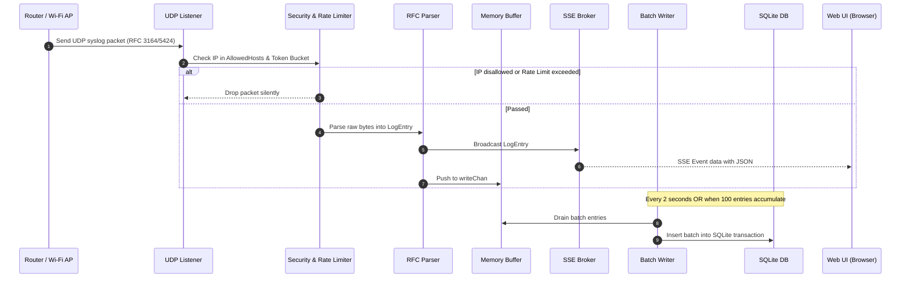
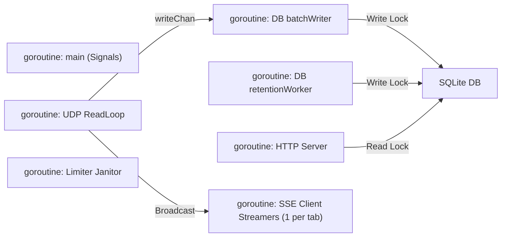

# Syslog Server for Home Assistant — Architecture & Design

This document provides a comprehensive technical overview of the **Home Assistant Syslog Server Add-on**, its component architecture, data pipelines, concurrency model, database design, and security mechanisms.

---

## 1. System Architecture Diagram



---

## 2. Ingestion & Streaming Sequence Diagram



---

## 3. Module Breakdown & Responsibilities

The codebase is organized into modular packages under `syslog-server/`:

```
syslog-server/
├── main.go                       # Lifecycle coordinator and signal trapping
└── internal/
    ├── config/config.go          # Config loader, options.json reader, CIDR parser
    ├── db/db.go                  # SQLite WAL abstraction, batching, queries, retention
    ├── syslog/
    │   ├── parser.go             # RFC 3164 and RFC 5424 parsing engine
    │   └── server.go             # UDP listener, token-bucket limiter, IP allowlist
    └── web/
        ├── server.go             # HTTP API handlers, SSE broker, Ingress integration
        └── ui/index.html         # Embedded responsive SPA (English/Russian)
```

### 3.1. `main.go` (Lifecycle Coordinator)
* Initializes the configuration from Home Assistant's `/data/options.json` (or environment defaults).
* Starts database subsystem, SSE broker, UDP listener, and HTTP server.
* Traps OS termination signals (`SIGINT`, `SIGTERM`).
* Executes sequential, idempotent graceful shutdown:
  1. Stops HTTP server (closes keep-alive connections).
  2. Stops UDP server (closes socket and termination channel).
  3. Flushes remaining memory buffer and closes SQLite database connection.

### 3.2. `internal/config` (Configuration Engine)
* Reads Home Assistant add-on options from `/data/options.json`.
* Parses `allowed_hosts` strings into structured IP and `net.IPNet` objects for fast, zero-allocation CIDR matching.
* Provides defaults for local testing outside of Home Assistant.

### 3.3. `internal/syslog` (Ingestion & Parsing)
* **UDP Listener (`server.go`):** Binds to port `514` (configurable). Uses a 4096-byte receive buffer to cap maximum datagram size.
* **Security & Rate Limiting:**
  * **IP Allowlist:** Checks source IP against configured static IPs and subnets.
  * **Token-Bucket Rate Limiter:** Each client IP has an independent token bucket (capacity: `RateLimitPerSec * 2`, refill rate: `RateLimitPerSec` tokens/sec). A background cleanup routine purges idle limiter buckets every 10 minutes to prevent memory leaks.
* **RFC Parser (`parser.go`):**
  * Automatically detects and parses **RFC 3164** (BSD Syslog: `<PRI>TIMESTAMP HOST TAG[PID]: MSG`) and **RFC 5424** (IETF Syslog: `<PRI>VERSION TIMESTAMP HOST APP-NAME PROCID MSGID ... MSG`).
  * Decodes `PRI` into Facility (0–23) and Severity (0–7: Emergency to Debug).
  * Robust fallback handling: if timestamp or hostname is omitted, automatically assigns current server time and the sender's source IP.

### 3.4. `internal/db` (High-Performance SQLite Storage)
* **Zero CGo:** Powered by `modernc.org/sqlite` (pure Go implementation of SQLite), allowing seamless compilation across `amd64`, `aarch64`, `armv7`, and `armhf`.
* **Flash Wear Mitigation:**
  * Operates in **WAL (Write-Ahead Logging)** mode.
  * `synchronous = NORMAL`: eliminates redundant `fsync` operations on flash storage without sacrificing transactional integrity during clean shutdown.
  * `busy_timeout = 5000`: prevents locking contention errors.
* **In-Memory Batch Writer:**
  * Ingestion routines write entries to a buffered channel (`writeChan`, capacity 1000).
  * The `batchWriter` goroutine commits transactions in chunks of up to 100 records or flushes on a 2-second timer.
* **Automated Retention Worker:**
  * Runs hourly in the background.
  * **Time-based retention:** Deletes records where `timestamp < datetime('now', '-N days')`.
  * **Size-based retention:** Checks physical file size of `syslog.db`. If size exceeds `max_db_size_mb`, automatically deletes the oldest 10,000 records.
  * Runs periodic `PRAGMA optimize`.
* **Manual Purge (`ClearAll`):**
  * Drains in-flight queue, executes `DELETE FROM syslog_entries;`, and immediately runs `VACUUM;` to reclaim disk space.

### 3.5. `internal/web` (Ingress Dashboard & REST API)
* Serves an embedded Single Page Application (`ui/index.html`) using Go 1.16+ `//go:embed`.
* **Relative URL Routing:** Compatible with Home Assistant Ingress dynamic subpaths (`/api/hassio_ingress/<token>/`).
* **Server-Sent Events (SSE) Broker:**
  * Manages active browser client channels.
  * Emits incoming parsed syslog records in real time.
  * Non-blocking broadcast drops slow consumers to protect server memory.
* **REST API Endpoints:**
  | Endpoint | Method | Description |
  | :--- | :--- | :--- |
  | `/` | `GET` | Serves embedded Web UI (SPA) |
  | `/api/logs` | `GET` | Paginated and filtered logs (`search`, `ip`, `severity`, `from`, `to`, `limit`, `offset`) |
  | `/api/stream` | `GET` | Live SSE stream of incoming events |
  | `/api/stats` | `GET` | Runtime statistics (total logs, DB size MB, retention days) |
  | `/api/hosts` | `GET` | List of distinct sending router IPs |
  | `/api/export` | `GET` | Download filtered logs as CSV or RAW text |
  | `/api/clear` | `POST` | Manually purge all records and vacuum SQLite database |

---

## 4. Concurrency & Thread-Safety Model



| Goroutine | Synchronization Primitive | Responsibility |
| :--- | :--- | :--- |
| **Main / Lifecycle** | `sync.Once` | Guarantees idempotent shutdown of DB and UDP listeners. |
| **UDP Listener** | `stopChan` (channel) | Terminated cleanly when add-on stops. |
| **Rate Limiter Janitor** | `limiterMu sync.Mutex` | Protects rate limiter map during writes and purges. |
| **DB Batch Writer** | `writeChan` (buffered chan) | Decouples network I/O from SQLite transactions. |
| **DB Retention Worker** | `d.mu sync.RWMutex` | Ensures retention deletes don't collide with queries. |
| **SSE Broker** | `sync.RWMutex` | Thread-safe registration and unregistration of SSE client channels. |

---

## 5. Security & Isolation Model

1. **Docker Container Sandbox:** Runs as an isolated Alpine-based container managed by Home Assistant Supervisor.
2. **Minimal Port Surface:**
   * Only UDP port `514` is mapped to the host network.
   * HTTP port `8099` is strictly bound to the internal Docker network and reverse-proxied via Home Assistant Ingress.
3. **No External Port Forwarding Needed:** Remote access is securely handled by Home Assistant Cloud / Nabu Casa or the user's secure reverse proxy.
4. **Denial-of-Service Defense:**
   * Token-Bucket rate limiting prevents log flooding attacks.
   * 4 KB UDP buffer prevents oversized packet buffer overflows.
   * CIDR allowlist rejects unwanted network traffic before parsing.
5. **DOM XSS Protection:**
   * All dynamic user content in the web dashboard is sanitized through `escapeHtml()` prior to DOM insertion.

---

## 6. Build and Distribution Pipeline

* **Multi-stage Dockerfile:** Builds the Go binary in `golang:1.23-alpine` with optimization flags (`-ldflags="-s -w"`), resulting in an image size of only **~8.2 MB**.
* **Target Architectures:** `aarch64` (ARM64), `amd64` (x86_64), `armv7` (32-bit ARM), `armhf`.
* Pure Go SQLite ensures identical, deterministic builds across all platforms without native toolchain complications.
