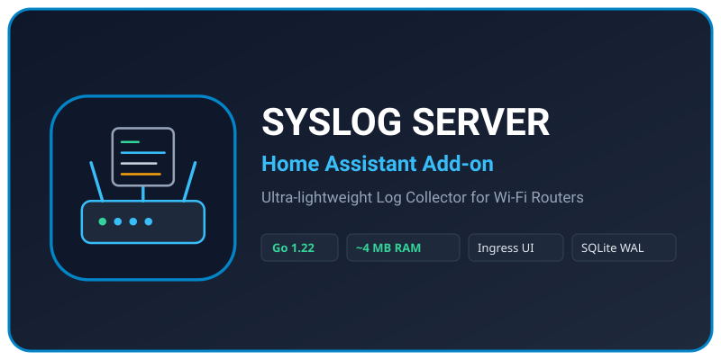

<p align="center">
  
</p>

# Home Assistant Syslog Server Add-on

[](https://www.home-assistant.io/)
[](https://golang.org/)
[](https://opensource.org/licenses/MIT)

[English](#english) | [Русский](#русский) | [Architecture Guide](ARCHITECTURE.md) | [Agent Guidelines](AGENTS.md)

---

<a name="english"></a>
## English

An ultra-lightweight, secure, and standalone **Syslog Server** add-on for Home Assistant, designed specifically to collect, stream, filter, and analyze system logs from Wi-Fi routers (Keenetic, MikroTik, OpenWrt, ASUS, TP-Link, UniFi, etc.) and local network infrastructure.

### 🌟 Key Highlights

- ⚡ **Ultra-Low Footprint:** Written in clean Go. Consumes only **~5–12 MB RAM** and **~0% CPU**.
- 🛡️ **Home Assistant DB Isolation:** Stores router logs in an isolated SQLite database using WAL (Write-Ahead Logging) and in-memory batch writes. Protects flash storage and prevents `home-assistant_v2.db` bloat.
- 🌐 **Embedded Ingress UI:** Opens directly within the Home Assistant sidebar under native authentication and SSL. No extra open HTTP ports required.
- 🔴 **Real-Time Live Streaming:** Instant real-time event tailing (802.11k/v/r roaming, client connect/disconnect, DHCP handshakes, errors) via Server-Sent Events (SSE).
- 🕒 **Time Range & Full-Text Filtering:** Quickly filter logs using preset intervals (Last 15m, 1h, 6h, 24h, 7d), custom date ranges, log severity, router IP, or keywords.
- 🗑️ **Manual Database Purge:** Easily clear and vacuum the database on demand directly from the web interface.
- 🔒 **Multi-Layered Security:**
  - IP Allowlist & CIDR subnet support.
  - Per-client Token-Bucket Rate Limiting (anti-flood).
  - Strict 4 KB UDP packet size enforcement.
- 🧹 **Automated Retention:** Auto-deletes logs older than `retention_days` and enforces a hard database size limit (`max_db_size_mb`).
- 📊 **Export:** One-click download of filtered logs in **CSV** or **RAW text** formats.
- 🌐 **Bilingual Interface:** English by default with instant toggle to Russian (saved in browser preference).

---

### 🚀 Installation in Home Assistant

1. Open your Home Assistant web interface.
2. Go to **Settings** -> **Add-ons** -> **Add-on Store** (button in the bottom right corner).
3. Click the **three dots in the top right corner** and select **Repositories**.
4. Enter this repository URL:
   ```text
   https://github.com/Mordevolt/ha-syslog-server
   ```
5. Click **Add**, then reload the store page.
6. Look for **Syslog Server** in the list, click it, and click **Install**.
7. Enable the **Show in sidebar** toggle, then click **Start**!

---

### 📡 Router Configuration

In your router's web administration panel, specify your Home Assistant server IP and UDP port `514`:

| Router | Where to configure |
| :--- | :--- |
| **Keenetic** | *Management* -> *Log* -> *Send to Syslog Server* -> IP: Home Assistant IP, Port: 514 |
| **MikroTik** | *System* -> *Logging* -> Add Action `remote` (HA IP, UDP 514) and attach in Rules |
| **OpenWrt** | *System* -> *System* -> *Logging* -> External system log server (HA IP, port 514) |
| **ASUS / TP-Link** | *Administration* / *System Log* -> *Remote Syslog Server* |

---

### 🛠️ Configuration Options

Options can be configured visually in the **Configuration** tab of the add-on:

```yaml
syslog_port: 514          # UDP port for incoming syslog messages
retention_days: 14        # Number of days to store logs
max_db_size_mb: 500       # Max SQLite database file size (MB)
rate_limit_per_sec: 100   # Max messages per second per IP
allowed_hosts: []         # Allowed IP list or CIDR subnets (e.g. ["192.168.1.1", "192.168.1.0/24"])
```

---

<a name="русский"></a>
## Русский

Сверхлегковесный, безопасный и автономный **Syslog Server** для Home Assistant, созданный для сбора, фильтрации и анализа системных логов с Wi-Fi роутеров (Keenetic, MikroTik, OpenWrt, Asus и др.) и сетевого оборудования.

### 🌟 Ключевые возможности

- ⚡ **Ультранизкое потребление ресурсов:** всего **~5–12 МБ RAM** и практически **0% CPU** (написан на Go).
- 🛡️ **Защита накопителя и базы данных Home Assistant:** логи хранятся в изолированной базе SQLite с режимом WAL и батчингом в памяти, не изнашивая накопитель и не раздувая `home-assistant_v2.db`.
- 🌐 **Встроенный интерфейс Ingress:** открывается прямо в боковом меню Home Assistant под встроенной авторизацией и SSL.
- 🔴 **Live Stream в реальном времени:** отслеживание событий Wi-Fi (роуминг 802.11k/v/r, подключение клиентов, ошибки, DHCP) на лету через Server-Sent Events (SSE).
- 🕒 **Фильтрация по времени:** быстрый выбор интервалов (15 мин, 1 час, 6 часов, 24 часа, 7 дней) или произвольный период дат.
- 🗑️ **Ручная очистка базы данных:** кнопка мгновенной очистки и сжатия (vacuum) базы прямо из интерфейса.
- 🔒 **Многоуровневая безопасность:** белый список IP-адресов роутеров (IP Allowlist / CIDR), защита от флуда (Rate Limiting), лимит размера пакетов (до 4 КБ).
- 🧹 **Автоматическая ротация:** удаление логов старше заданного количества дней (`retention_days`) и жесткий контроль максимального размера базы (`max_db_size_mb`).
- 📊 **Экспорт данных:** скачивание отфильтрованных логов в один клик в форматах **CSV** или **RAW TXT**.
- 🌐 **Двуязычный интерфейс:** английский по умолчанию с возможностью переключения на русский в заголовке страницы.

---

## 📄 License

Licensed under the [MIT License](LICENSE).
